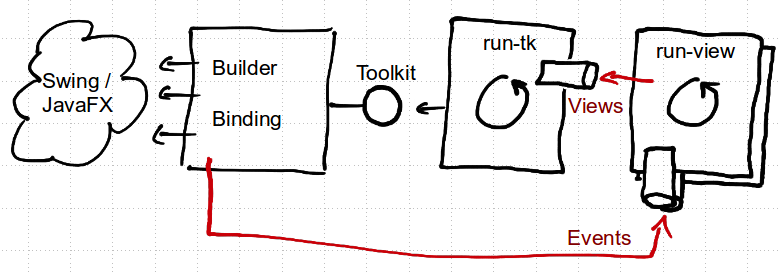

# async-ui

A prototype demonstrating JavaFX or Swing GUI programming with clojure.core.async.

Here's a working [example](src/async_ui/ex_master_detail.clj).

## What it shows

 * A UI form with all its state represented by pure data.
 * Specification of UI forms and event processing is free of access to
   JavaFX APIs, and can therefore be tested without any GUI test robots.
 * Event processing and communication among UI forms is free of
   callbacks or direct thread-handling, and uses core.async channels
   instead.

## Overview



A *View* is a map that contains a specification of the visual
component tree, the domain data, a mapping between both, validation
rules and validation results (for more details see the Concepts
section). This data represents the state of a UI form. Each view has
it's own events channel. For each view, one process is started using
the `run-view` function, which processes events for that view. "Event
processing" means that the data contained in the event is merged into
the view state, validation is applied, an individual handler is
invoked and the resulting view is passed via a central channel to
another process that is responsible for synchronization with the UI
Toolkit.

As mentioned in the previous paragraph there is a single toolkit
oriented process, started via `run-tk`, which processes views it
receives via a central channel. "Processing a view" means initially to
actually create the visual component tree using the UI
Toolkit. Further updates of the view are processed by writing the data
from the view into the property values of the visual components.

The concrete UI toolkit like JavaFX or Swing is hidden behind the
*Toolkit* protocol. It is mainly implemented by a builder and a
binding. The builder takes views specification of a form and produces
a visual component tree. The binding registers listeners that put an
event onto the views own events channel and creates setters that
update the visual components properties with the data contained in the
view.


## Concepts

A *Spec* is a map representing a UI form. A spec can be created with expressions
like this:
```clojure
(window "Item Editor"
        :content
        (panel "Content" :lygeneral "wrap 2, fill" :lycolumns "[|100,grow]" 
               :components
               [(label "Text") (textfield "text" :lyhint "growx")
                (panel "Actions" :lygeneral "ins 0" :lyhint "span, right"
                       :components
                       [(button "OK") (button "Cancel")])]))
```

A *Component Path* is a vector of visual component names.


A *Property Path* is a component path conj'ed with a keyword
representing a property within a visual component.


A *Mapping* is a vector of maps.
Each of these maps contains

 - :data-path      -- A vector or single keyword pointing to a piece of data in a map
 - :property-path  -- A vector consisting of a Component Path conj'ed with a keyword
                      denoting the property in the visual component.
 - :formatter      -- A function converting from a value to a human readable text
 - :parser         -- A function converting a human readable text to a value


A *View* is a map containing all data necessary for a UI form and the
visual component tree.

 - :id                   -- A string uniquely identifing this view
 - :spec                 -- A model of the form (see forml namespace for the metamodel)
 - :vc                   -- The tree of visual components
 - :data                 -- A map with all domain and view-state data of the form
 - :mapping              -- A vector of mappings between visual component
                            properties and data in the :data map
 - :events               -- The channel for receiving events
 - :setter-fns           -- A map of data-path to 1-arg functions used to update
                            visual component properties values
 - :validation-rule-set  -- A vector of validation rules (see examine library)
 - :validation-results   -- Current validation results (see examine library)

A view is created like so:

```clojure
(defn item-editor-view
  [data]
  (-> (v/make-view "item-editor"
                   (window "Item Editor"
                           :content
                           (panel "Content" :lygeneral "wrap 2, fill" :lycolumns "[|100,grow]" 
                                  :components
                                  [(label "Text") (textfield "text" :lyhint "growx")
                                   (panel "Actions" :lygeneral "ins 0" :lyhint "span, right"
                                          :components
                                          [(button "OK") (button "Cancel")])])))
      (assoc :mapping (v/make-mapping :text ["text" :text])
             :validation-rule-set (e/rule-set :text (c/min-length 1))
             :data data)))
```


An *Event* is a map with keys

 - :source   -- Points to a visual components property or other source
 - :type     -- A keyword denoting the type of event.
             Common event types are :update or :action.
 - :payload  -- Arbitrary data


An *Event Handler* is a function that is invoked by the view process to
process an event and possibly create a new version of the view.

Here's an example of a simple event handler:

```clojure
(defn item-editor-handler
  [view event]
  (go (case ((juxt :source :type) event)
        ["OK" :action]
        (assoc view :terminated true)
        ["Cancel" :action]
        (assoc view
          :terminated true
          :cancelled true)
        view)))
```

A *Component Map* contains all visual components indexed by their
corresponding component paths.


A *Toolkit* provides uniform access to functionalities of Swing or JavaFX.

```clojure
(defprotocol Toolkit
  (run-now [tk f]
    "Executes function f in toolkits event processing thread.")
  (show-view! [tk view]
    "Makes the root of the visual component tree visible.")
  (hide-view! [tk view]
    "Makes the root of the visual component tree invisible.")
  (build-vc-tree [tk view]
    "Creates a visual component tree from the data in the :spec slot of the view.
  Returns the view with an updated :vc slot.")
  (bind-vc-tree! [tk view]
    "Attaches listeners to visual components that put events to the :events channel of the view.
  Returns the view with :setter-fns slot updated.")
  (vc-name [tk vc]
    "Returns the name of the visual component.")
  (vc-children [tk vc]
    "Returns a seq with the children of the visual component or [] if it doesn't have any.")
  (set-vc-error! [tk vc msgs]
    "Updates the error state of a visual component according to the messages seq msgs.
  Empty msgs remove the error state."))
```

## Adding visual component types

This prototype supports only a small number of component types.  To
add support for a type of visual component one has to add at least one
datatype in src/async_ui/forml.clj with corresponding defaults.

To support a type of visual component within a specific toolkit there
are three methods to add:

* `build` in builder.clj that produces a component instance from the
  spec.
* `bind!` in binding.clj that registers event listeners that put
  events to the views `:events` channel.
* `setter-fns` in binding.clj that returns a map of component specific
  functions that update a property of component from a value.


## Usage

Make sure you're on JDK 1.8.0_25. Clone this project.

### REPL

* Open the file `src/async_ui/ex_master_detail.clj` and compile it.
* `(do (ns async-ui.ex-master-detail) (start!))`

### Standalone

You can run the application using `lein run`.

Alternatively you can create an all-in-one Jar using `lein uberjar`
and execute the resulting Jar (`java -jar ...`).

NOTE: For some weird technical reasons JavaFX needs to have its
Application Thread started for some of the classes to be loaded
properly. In other words, the compilation process starts a JavaFX
thread, which blocks JVM termination after compilation finished. As a
remedy, an environment var in the uberjar profile is used to detect
compilation and a `Platform/exit` is issued after some seconds, but
termination still takes about 1 minute. Be patient.

NOTE: If you start the Jar from the project directory with
`java -jar target/async-ui-0.1.0-SNAPSHOT-standalone.jar` make sure
you delete .lein-env beforehand.

Currently there is no proper application exit. Ctrl-C helps.


## License

Copyright 2014 F.Riemenschneider

Distributed under the Eclipse Public License, the same as Clojure.
